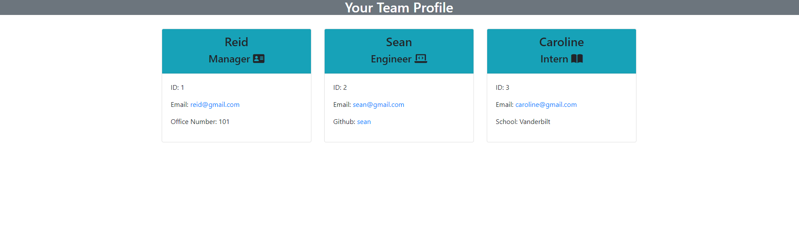

# Team Generator

## Purpose
A Team Creation application made with Node.js This application allows you to create your team with an easily readable commandline questionnaire. This Application allows you to select the role of your team member and create a new HTML card based on their role.  

Once a user answers 'no' to the question: 'Would you like to add another teammate?', your HTML page will be created with your brand new team! 

## Built With
* JavaScript
* HTML
* Bootstrap

## Test Video
[Test](https://drive.google.com/file/d/1DvL9VIUj6i0ZZyar9bN-m1Xe-1c9an6m/view)

## Preview

## Contribution
Reid Schroder